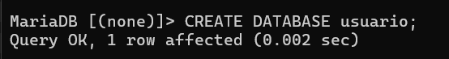

# Proyecto Interfaz de Bienestar para Jóvenes Universitarios

## 🛑 ¿Por qué no se puede convertir directamente un formulario de Java a HTML?

En el desarrollo de software, los formularios son una parte fundamental para capturar datos del usuario. Sin embargo, no todos los formularios se crean igual. Un formulario hecho en Java usando Swing en NetBeans **no puede convertirse automáticamente a HTML**, ya que ambas tecnologías operan en entornos y lenguajes completamente distintos.

| Característica | Java Swing NetBeans | HTML (Servidor Web) |
| --- | --- | --- |
| Tipo de aplicación | Escritorio (GUI local) | Web (se ejecuta en navegador) |
| Lenguaje principal | Java | HTML + CSS + JavaScript |
| Entorno de ejecución | JVM (Java Virtual Machine) | Navegador Web |
| Componentes | `JButton`, `JTextField`, `JLabel`  | `<button>`, `<input>`, `<label>` |
| Gestión de eventos | `ActionListener`  | JavaScript (`addEventListener`) |

**Integrantes:** 

López Bautista Miguel Angel

Barragán Yescas José Francisco

**Introducción:**

Los jóvenes universitarios en esta nueva etapa pasan por diferentes problemas emocionales y situaciones que les generan ansiedad, estrés, miedo, tristeza, depresión, enojo, frustración, entre otros problemas. Esto debido a diferentes motivos como la transición inmediata a la etapa adulta, las enormes exigencias que exige la universidad tanto académicas como económicas, las altas expectativas que suele tener tanto la familia como las personas en la sociedad, la grande carga de trabajos y horarios pesados, entre otros motivos.

EmotiUni es una interfaz de Bienestar Universitario que busca ayudar a esos estudiantes a tener un mejor manejo de sus emociones con pequeños campos y áreas que se enfocan en darles actividades, guías, consejos, entre otros elementos y recomendaciones que les ayudarán a tener un mejor manejo en sus emociones y así tener un mejor control en sus estudios y estancia en la universidad.

## XAMAPP Creación de Base de Datos para el proyecto

En este apartado se guardará la base de datos y la respectiva tabla para el apartado de Diario, un apartado en donde el usuario podrá colocar y redactar un poco de su experiencia y su estado de ánimo para tener una zona de privacidad y tranquilidad, para posteriormente toda esa información se guardará en la base de datos donde tanto la información que escriba ahora como posteriormente, se guardará en la tabla con la base de datos.

---

**Realizar Conexion con MariaDB**

```sql
mysql -u root -h localhost -p
```


---

**Crear base de datos**

```sql
CREATE DATABASE usuario;
```



---

**Seleccionar la base de datos usuario**

```sql
USE usuario;
```


---

**Crear la tabla**

```sql
CREATE TABLE Notas (
    idNota INT,
    nota VARCHAR(255),
    edoAnimo VARCHAR(255),
    fecha VARCHAR(255)
);
```


**Describir tabla:**

```jsx
DESCRIBE nota
```

```sql
INSERT INTO Notas (idNota, nota, edoAnimo, fecha) VALUES
(1, 'Hoy estuve feliz', 'Feliz', '26 de Julio'),
(2, 'Hoy estuve cansado', 'cansado', '2 de junio'),
(3, 'Me encuentro triste', 'triste', '14 de mayo'),
(4, 'Hoy me siento confiado', 'confiado', '1 de agosto'),
(5, 'Hoy me siento de maravilla', 'feliz', '1 de septiembre'),
(6, 'Hoy me asusté', 'asustado', '2 de agosto'),
(7, 'Hoy me fue de maravilla', 'alegre', '3 de agosto'),
(8, 'El día de ayer me pegaron', 'adolorido', '30 de julio'),
(9, 'Hoy me putearin', 'outeado', 'hoy'),
(10, 'Estoy triste', 'Triste', '4 de Agosto'),
(11, 'Me encuentro frustrado pues no pasé otro examen', 'Frustrado', '5 de Agosto'),
(12, 'Estoy cansado', 'cansado', '6 de agosto'),
(13, 'Estoy inspirada', 'Inspirada', '6 de agosto');
```


# Crear conexión de Java a MySQL

Primero hay que descargar los drives “Mysql connector Java.jar”

https://dev.mysql.com/downloads/connector/j/


**Archivo de conexion a la base de datos *ConexionBD.java***

```jsx
public class ConexionBD {
    private final String url;
    private final String usuario;
    private final String password;
    
    public ConexionBD(){
        url = "jdbc:mysql://localhost:3306/usuario";
        usuario = "root";
        password = "";
    }
    public Connection conecta(){
        Connection cx=null;
    
        try {
            cx = DriverManager.getConnection(url,usuario,password);
            System.out.println("Si conecto la base de datos");
        } catch (SQLException ex) {
            Logger.getLogger(ConexionBD.class.getName()).log(Level.SEVERE, null, ex);
        }
                    
        
        return cx;
    }

```


# Funcionamiento y contenidos de la interfaz

La interfaz se compone de una ventana de inicio de sesión llamada “Ventana”, en donde se pedirá el nombre de usuario y matrícula para poder ingresar a la interfaz, de lo contrario no permitirá el acceso.

**Diseño:**


Código:

En esta interfaz no se hará gran cosa, solamente colocar las condiciones para que al colocar los elementos pedidos este pueda dar o no dar acceso a la interfaz

```jsx
private void btnAceptarActionPerformed(java.awt.event.ActionEvent evt) {                                           
        // TODO add your handling code here:
        String nombre = txtNombre.getText();
        String matricula = txtMatricula.getText();
        String usuario = "Miguel";
        
        if (!nombre.isEmpty()){ //AND OR NOT EN JAVA 
           Inicio formulario = new Inicio();
            formulario.setVisible(true);
            this.dispose(); 
        }
    }             
```

**Interfaz “Inicio”**

Esta es la interfaz principal en donde se todas las funciones se darán a funcionar por medio de los botones, incluyendo imágenes para darles un toque y estilo, incluyendo códigos y funciones para que al darles click nos lleven a las interfaces de la respectiva función.

**Código de funciones:**

```jsx
private void btnDiarioActionPerformed(java.awt.event.ActionEvent evt) {                                          
        // TODO add your handling code here:
        DiarioDB formulario = new DiarioDB();
        formulario.setVisible(true);
        this.dispose();
    }                                         

    private void jButton1ActionPerformed(java.awt.event.ActionEvent evt) {                                         
        // TODO add your handling code here:
        Emocion formulario = new Emocion();
        formulario.setVisible(true);
        this.dispose();
    }                                        

    private void btnMeditarActionPerformed(java.awt.event.ActionEvent evt) {                                           
        // TODO add your handling code here:
        Meditar formulario = new Meditar();
        formulario.setVisible(true);
        this.dispose();
    }                                          

    private void btnActividadActionPerformed(java.awt.event.ActionEvent evt) {                                             
        // TODO add your handling code here:
        Actividad formulario = new Actividad();
        formulario.setVisible(true);
        this.dispose();
    }                                            

    private void btnImagenActionPerformed(java.awt.event.ActionEvent evt) {                                          
        // TODO add your handling code here:
        Imagen formulario = new Imagen();
        formulario.setVisible(true);
        this.dispose();
    }                                         

    private void btnRecomendacionActionPerformed(java.awt.event.ActionEvent evt) {                                                 
        // TODO add your handling code here:
        Recomendacion formulario = new Recomendacion();
        formulario.setVisible(true);
        this.dispose();
    }                                                

```


**Interfaz Emociones:**

En este apartado el usuario podrá elegir una de las ocho emociones planteadas en la interfaz por defecto, las cuales por medio de clases se conectarán a la clase “Emoción”, que es donde se da la función, y según la emoción, el programa le dará un consejo o frase motivadora a la persona con el fin de tratar de ayudarla a mejorar un poco su estado emocional si es negativo, y si es positivo, darle más ánimos para seguir adelante, esta función se compone por otras pequeñas interfaces de otras emociones que son: Feliz, asustado, nervioso, inspirado, enojado, curioso y triste.

Diseño:


Código:

```jsx
private void btnReturnActionPerformed(java.awt.event.ActionEvent evt) {                                          
        // TODO add your handling code here:
        Inicio formVent = new Inicio();
        formVent.setVisible(true);
        this.dispose();
    }                                         

    private void btnFelizActionPerformed(java.awt.event.ActionEvent evt) {                                         
    Feliz formulario = new Feliz();
    formulario.setVisible(true);
    this.dispose();
        // TODO add your handling code here:
    }                                        

    private void btnAsustadoActionPerformed(java.awt.event.ActionEvent evt) {                                            
        // TODO add your handling code here:
        Asustado formulario = new Asustado();
    formulario.setVisible(true);
    this.dispose();
    }                                           

    private void btnTristeActionPerformed(java.awt.event.ActionEvent evt) {                                          
        // TODO add your handling code here:
        Triste formulario = new Triste();
        formulario.setVisible(true);
        this.dispose();
    }                                         

    private void btnInspiradoActionPerformed(java.awt.event.ActionEvent evt) {                                             
        // TODO add your handling code here:
       Inspirado formulario = new Inspirado();
       formulario.setVisible(true);
       this.dispose();
    }                                            

    private void btnEnojadoActionPerformed(java.awt.event.ActionEvent evt) {                                           
        // TODO add your handling code here:
    Enojado formulario = new Enojado();
    formulario.setVisible(true);
    this.dispose();
    }                                          

    private void btnCuriosoActionPerformed(java.awt.event.ActionEvent evt) {                                           
        // TODO add your handling code here:
    Curioso formulario = new Curioso();
    formulario.setVisible(true);
    this.dispose();
    }                                          

    private void btnSadActionPerformed(java.awt.event.ActionEvent evt) {                                       
        // TODO add your handling code here:
    Sad formulario = new Sad();
    formulario.setVisible(true);
    this.dispose();
    }                                            
```


Todas las clases de las emociones tienen el mismo código y función, pero cambiando unicamente el nombre de la emoción, por lo que ahora solo se mostrará una imagen de ejemplo, pero el procedimiento para el resto es el mismo, solo cambiando el nombre de la emoción.


```jsx
private void btnReturnActionPerformed(java.awt.event.ActionEvent evt) {                                          
        // TODO add your handling code here:
        Emocion formVent = new Emocion();
        formVent.setVisible(true);
        this.dispose();
    }              
    private void btnReturnActionPerformed(java.awt.event.ActionEvent evt) {                                          
        // TODO add your handling code here:
        Emocion formVent = new Emocion();
        formVent.setVisible(true);
        this.dispose();
    }      
    private void btnReturnActionPerformed(java.awt.event.ActionEvent evt) {                                          
        // TODO add your handling code here:
        Emocion formVent = new Emocion();
        formVent.setVisible(true);
        this.dispose();
    }     
    private void btnReturnActionPerformed(java.awt.event.ActionEvent evt) {                                          
        // TODO add your handling code here:
        Emocion formVent = new Emocion();
        formVent.setVisible(true);
        this.dispose();
    }           
     
                              

```

**DiarioDB:**

En este apartado será donde estará almacenada la base de datos, específicamente la que hemos hecho en Xampp, en el que el usuario podrá ingresar sus experiencias, estado de ánimo y de otras cosas más para después ingresarlas en una base de datos por medio de las funciones y la clase que contecta la base con el programa anteriormente mostrada, con elementos como un botón para regresar al inicio:

-Un apartado de Nota para que el usuario pueda colocar sus notas y anécdotas.

-Estado de Ánimo para que el usuario diga cómo se siente.

-Fecha: El usuario podrá colocar la fecha.


**Código:**

```jsx
public class DiarioDB extends javax.swing.JFrame {
 private Notas a;
        
    /**
     * Creates new form Mantenimiento
     */
    
    public DiarioDB() {
        initComponents();
       
                  
}
      private void llenaColumna(DefaultTableModel modelo, String titulo[]){
          for (int i = 0; i < titulo.length; i++){
           modelo.addColumn(titulo[i]);
        }
      }
      private void llenaFila(DefaultTableModel modelo,ResultSet rs, int col) throws SQLException{
          while(rs.next()){
              Object fila[] = new Object[col];
              for(int i = 0; i < col; i++){
                  fila[i] = rs.getObject(i+1);
                  
             }             
              modelo.addRow(fila);
          }
      }

    /**
     * This method is called from within the constructor to initialize the form.
     * WARNING: Do NOT modify this code. The content of this method is always
     * regenerated by the Form Editor.
     */
    @SuppressWarnings("unchecked")
    // <editor-fold defaultstate="collapsed" desc="Generated Code">                          
    private void initComponents() {

        lblTitulo = new javax.swing.JLabel();
        lblNota = new javax.swing.JLabel();
        lblEstadoAnimo = new javax.swing.JLabel();
        lblFecha = new javax.swing.JLabel();
        btnActualizar = new javax.swing.JButton();
        btnGuardar = new javax.swing.JButton();
        btnCancelar = new javax.swing.JButton();
        jScrollPane1 = new javax.swing.JScrollPane();
        JTable1 = new javax.swing.JTable();
        txtNota = new javax.swing.JTextField();
        txtEstadoAnimo = new javax.swing.JTextField();
        txtFecha = new javax.swing.JTextField();
        btnReturn = new javax.swing.JButton();

        setDefaultCloseOperation(javax.swing.WindowConstants.EXIT_ON_CLOSE);
        setBackground(new java.awt.Color(200, 100, 255));

        lblTitulo.setText("Alumno");

        lblNota.setText("Nota");

        lblEstadoAnimo.setText("Estado Animo");

        lblFecha.setText("Fecha");

        btnActualizar.setText("Actualizar");
        btnActualizar.addActionListener(new java.awt.event.ActionListener() {
            public void actionPerformed(java.awt.event.ActionEvent evt) {
                btnActualizarActionPerformed(evt);
            }
        });

        btnGuardar.setBackground(new java.awt.Color(0, 255, 0));
        btnGuardar.setText("Guardar");
        btnGuardar.addActionListener(new java.awt.event.ActionListener() {
            public void actionPerformed(java.awt.event.ActionEvent evt) {
                btnGuardarActionPerformed(evt);
            }
        });

        btnCancelar.setBackground(new java.awt.Color(255, 0, 0));
        btnCancelar.setText("Cancelar");
        btnCancelar.addActionListener(new java.awt.event.ActionListener() {
            public void actionPerformed(java.awt.event.ActionEvent evt) {
                btnCancelarActionPerformed(evt);
            }
        });

        JTable1.setModel(new javax.swing.table.DefaultTableModel(
            new Object [][] {
                {null, null, null, null},
                {null, null, null, null},
                {null, null, null, null},
                {null, null, null, null},
                {null, null, null, null}
            },
            new String [] {
                "idNota", "nota", "edoAnimo", "fecha"
            }
        ) {
            Class[] types = new Class [] {
                java.lang.String.class, java.lang.String.class, java.lang.String.class, java.lang.String.class
            };

            public Class getColumnClass(int columnIndex) {
                return types [columnIndex];
            }
        });
        jScrollPane1.setViewportView(JTable1);

        btnReturn.setText("Return");
        btnReturn.addActionListener(new java.awt.event.ActionListener() {
            public void actionPerformed(java.awt.event.ActionEvent evt) {
                btnReturnActionPerformed(evt);
            }
        });

        javax.swing.GroupLayout layout = new javax.swing.GroupLayout(getContentPane());
        getContentPane().setLayout(layout);
        layout.setHorizontalGroup(
            layout.createParallelGroup(javax.swing.GroupLayout.Alignment.LEADING)
            .addGroup(layout.createSequentialGroup()
                .addGroup(layout.createParallelGroup(javax.swing.GroupLayout.Alignment.LEADING, false)
                    .addGroup(layout.createSequentialGroup()
                        .addGroup(layout.createParallelGroup(javax.swing.GroupLayout.Alignment.LEADING)
                            .addGroup(layout.createSequentialGroup()
                                .addGroup(layout.createParallelGroup(javax.swing.GroupLayout.Alignment.LEADING)
                                    .addGroup(layout.createSequentialGroup()
                                        .addGap(34, 34, 34)
                                        .addComponent(lblNota, javax.swing.GroupLayout.PREFERRED_SIZE, 73, javax.swing.GroupLayout.PREFERRED_SIZE)
                                        .addGap(22, 22, 22))
                                    .addGroup(javax.swing.GroupLayout.Alignment.TRAILING, layout.createSequentialGroup()
                                        .addGap(14, 14, 14)
                                        .addComponent(lblEstadoAnimo, javax.swing.GroupLayout.PREFERRED_SIZE, 109, javax.swing.GroupLayout.PREFERRED_SIZE)))
                                .addGap(56, 56, 56)
                                .addComponent(txtNota, javax.swing.GroupLayout.PREFERRED_SIZE, 233, javax.swing.GroupLayout.PREFERRED_SIZE))
                            .addGroup(layout.createSequentialGroup()
                                .addGap(65, 65, 65)
                                .addComponent(btnGuardar)
                                .addGap(79, 79, 79)
                                .addComponent(btnCancelar))
                            .addGroup(layout.createSequentialGroup()
                                .addGap(149, 149, 149)
                                .addComponent(btnActualizar)))
                        .addGap(8, 8, 8))
                    .addGroup(javax.swing.GroupLayout.Alignment.TRAILING, layout.createSequentialGroup()
                        .addGap(20, 20, 20)
                        .addGroup(layout.createParallelGroup(javax.swing.GroupLayout.Alignment.TRAILING)
                            .addGroup(layout.createSequentialGroup()
                                .addComponent(lblFecha, javax.swing.GroupLayout.PREFERRED_SIZE, 117, javax.swing.GroupLayout.PREFERRED_SIZE)
                                .addGap(42, 42, 42)
                                .addComponent(txtFecha, javax.swing.GroupLayout.PREFERRED_SIZE, 241, javax.swing.GroupLayout.PREFERRED_SIZE))
                            .addComponent(txtEstadoAnimo, javax.swing.GroupLayout.PREFERRED_SIZE, 241, javax.swing.GroupLayout.PREFERRED_SIZE))
                        .addPreferredGap(javax.swing.LayoutStyle.ComponentPlacement.RELATED))
                    .addGroup(layout.createSequentialGroup()
                        .addGap(175, 175, 175)
                        .addComponent(lblTitulo, javax.swing.GroupLayout.PREFERRED_SIZE, 86, javax.swing.GroupLayout.PREFERRED_SIZE)
                        .addPreferredGap(javax.swing.LayoutStyle.ComponentPlacement.RELATED, javax.swing.GroupLayout.DEFAULT_SIZE, Short.MAX_VALUE)
                        .addComponent(btnReturn)
                        .addGap(40, 40, 40)))
                .addComponent(jScrollPane1, javax.swing.GroupLayout.PREFERRED_SIZE, javax.swing.GroupLayout.DEFAULT_SIZE, javax.swing.GroupLayout.PREFERRED_SIZE)
                .addContainerGap(126, Short.MAX_VALUE))
        );
        layout.setVerticalGroup(
            layout.createParallelGroup(javax.swing.GroupLayout.Alignment.LEADING)
            .addGroup(layout.createSequentialGroup()
                .addGroup(layout.createParallelGroup(javax.swing.GroupLayout.Alignment.LEADING)
                    .addGroup(layout.createSequentialGroup()
                        .addGroup(layout.createParallelGroup(javax.swing.GroupLayout.Alignment.LEADING)
                            .addGroup(layout.createSequentialGroup()
                                .addContainerGap()
                                .addComponent(btnReturn)
                                .addGap(32, 32, 32)
                                .addGroup(layout.createParallelGroup(javax.swing.GroupLayout.Alignment.BASELINE)
                                    .addComponent(lblNota, javax.swing.GroupLayout.PREFERRED_SIZE, 27, javax.swing.GroupLayout.PREFERRED_SIZE)
                                    .addComponent(txtNota, javax.swing.GroupLayout.PREFERRED_SIZE, javax.swing.GroupLayout.DEFAULT_SIZE, javax.swing.GroupLayout.PREFERRED_SIZE)))
                            .addGroup(javax.swing.GroupLayout.Alignment.TRAILING, layout.createSequentialGroup()
                                .addComponent(lblTitulo)
                                .addGap(105, 105, 105)))
                        .addGap(4, 4, 4)
                        .addGroup(layout.createParallelGroup(javax.swing.GroupLayout.Alignment.TRAILING)
                            .addComponent(txtEstadoAnimo, javax.swing.GroupLayout.PREFERRED_SIZE, javax.swing.GroupLayout.DEFAULT_SIZE, javax.swing.GroupLayout.PREFERRED_SIZE)
                            .addComponent(lblEstadoAnimo))
                        .addGap(47, 47, 47)
                        .addGroup(layout.createParallelGroup(javax.swing.GroupLayout.Alignment.BASELINE)
                            .addComponent(lblFecha, javax.swing.GroupLayout.PREFERRED_SIZE, 24, javax.swing.GroupLayout.PREFERRED_SIZE)
                            .addComponent(txtFecha, javax.swing.GroupLayout.PREFERRED_SIZE, javax.swing.GroupLayout.DEFAULT_SIZE, javax.swing.GroupLayout.PREFERRED_SIZE))
                        .addGap(64, 64, 64)
                        .addComponent(btnActualizar)
                        .addPreferredGap(javax.swing.LayoutStyle.ComponentPlacement.RELATED, javax.swing.GroupLayout.DEFAULT_SIZE, Short.MAX_VALUE)
                        .addGroup(layout.createParallelGroup(javax.swing.GroupLayout.Alignment.BASELINE)
                            .addComponent(btnGuardar)
                            .addComponent(btnCancelar)))
                    .addComponent(jScrollPane1, javax.swing.GroupLayout.PREFERRED_SIZE, javax.swing.GroupLayout.DEFAULT_SIZE, javax.swing.GroupLayout.PREFERRED_SIZE))
                .addContainerGap(79, Short.MAX_VALUE))
        );

        pack();
    }// </editor-fold>                        

    private void btnGuardarActionPerformed(java.awt.event.ActionEvent evt) {                                           
        a = new Notas();
        a.setNota(this.txtNota.getText());
        a.setEdoAnimo(this.txtEstadoAnimo.getText());
        a.setFecha(this.txtFecha.getText());
           
        if(a.alta()){
            JOptionPane.showMessageDialog(this, "Se guardo el registro");
            txtNota.setText("");
           txtEstadoAnimo.setText("");
           txtFecha.setText("");
        }
        
        else
            JOptionPane.showMessageDialog(this,"No se guardo el registro");
        
    }                                          

    private void btnCancelarActionPerformed(java.awt.event.ActionEvent evt) {                                            
           txtNota.setText("");
           txtEstadoAnimo.setText("");
           txtFecha.setText("");
    }                                           

    private void btnActualizarActionPerformed(java.awt.event.ActionEvent evt) {                                              
             try {
            // TODO add your handling code here:
            NotasCrud nc = new NotasCrud();
            String t [] = {"idNota", "nota", "edoAnimo", "fecha"};
            DefaultTableModel m = new DefaultTableModel();
            this.JTable1.setModel(m);
            llenaColumna(m,t
            );
            llenaFila(m, nc.ReportGen(),t.length);
        } catch (SQLException ex) {
            Logger.getLogger(Mantenimiento.class.getName()).log(Level.SEVERE, null, ex);
        }
    }                                             

```

**Meditar:**

En este apartado se dará por medio de las interfaces una pequeña guía de cinco pasos para poder hacer una meditación que ayude a relajar al usuario, con una interfaz que dará la bienvenida al usuario y unas instrucciones antes de comenzar, con un botón que diga comenzar y después las ventanas tendrán una imagen, los textos de las instrucciones y dos botones, uno que irá a la siguiente diapositiva y otro que volverá, una vez acabado el paso final, habrá un botón que llevará a la ventana de Inicio de nuevo.


```jsx
private void btnReturnActionPerformed(java.awt.event.ActionEvent evt) {                                          
        // TODO add your handling code here:
        Inicio formVent = new Inicio();
        formVent.setVisible(true);
        this.dispose();
    }                                         

    private void btnComenzarActionPerformed(java.awt.event.ActionEvent evt) {                                            
        // TODO add your handling code here:
        Paso1 formVent = new Paso1();
        formVent.setVisible(true);
        this.dispose();
    }                  
```

Paso 1 2 3 4 5:


```jsx
private void btnReturnActionPerformed(java.awt.event.ActionEvent evt) {                                          
        // TODO add your handling code here:
        Inicio formVent = new Inicio();
        formVent.setVisible(true);
        this.dispose();
    }                                         

    private void btnComenzarActionPerformed(java.awt.event.ActionEvent evt) {                                            
        // TODO add your handling code here:
        Paso1 formVent = new Paso1();
        formVent.setVisible(true);
        this.dispose();
    }            
    private void btnPaso1ActionPerformed(java.awt.event.ActionEvent evt) {                                         
        // TODO add your handling code here:
        Paso2 formVent = new Paso2();
        formVent.setVisible(true);
        this.dispose();
    }    
     private void btnPaso2ActionPerformed(java.awt.event.ActionEvent evt) {                                         
        // TODO add your handling code here:
        Paso3 formVent = new Paso3();
        formVent.setVisible(true);
        this.dispose();
    }                                        

    private void btnBackActionPerformed(java.awt.event.ActionEvent evt) {                                        
        // TODO add your handling code here:
        Paso1 formVent = new Paso1();
        formVent.setVisible(true);
        this.dispose();
    }           
    private void btnPaso3ActionPerformed(java.awt.event.ActionEvent evt) {                                         
        // TODO add your handling code here:
        Paso4 formVent = new Paso4();
        formVent.setVisible(true);
        this.dispose();
    }                                        

    private void btnBackActionPerformed(java.awt.event.ActionEvent evt) {                                        
        // TODO add your handling code here:
        Paso2 formVent = new Paso2();
        formVent.setVisible(true);
        this.dispose();
    }             
    private void btnPaso5ActionPerformed(java.awt.event.ActionEvent evt) {                                         
        // TODO add your handling code here:
        PasoFinal formVent = new PasoFinal();
        formVent.setVisible(true);
        this.dispose();
    }                                        

    private void btnBackActionPerformed(java.awt.event.ActionEvent evt) {                                        
        // TODO add your handling code here:
        Paso4 formVent = new Paso4();
        formVent.setVisible(true);
        this.dispose();
    }                                       
  private void btnReturnActionPerformed(java.awt.event.ActionEvent evt) {                                          
        // TODO add your handling code here:
        Inicio formVent = new Inicio();
        formVent.setVisible(true);
        this.dispose();
    }                                         

    private void btnBackActionPerformed(java.awt.event.ActionEvent evt) {                                        
        // TODO add your handling code here:
        Paso5 formVent = new Paso5();
        formVent.setVisible(true);
        this.dispose();
    }                                       

    
```